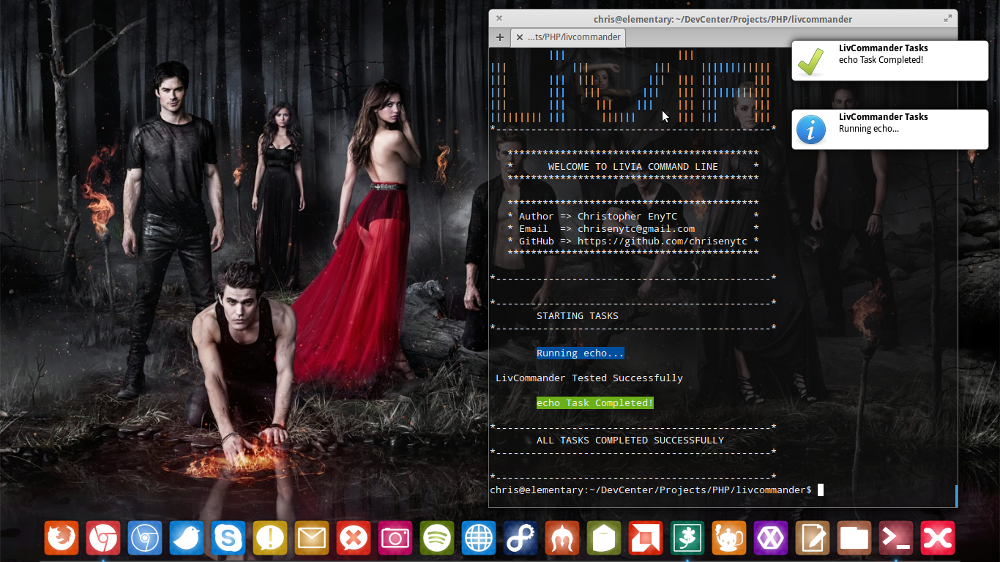

# LivCommander [](https://travis-ci.org/chrisenytc/livcommander) [](https://packagist.org/packages/chrisenytc/livcommander) [](https://packagist.org/packages/chrisenytc/livcommander)

Livia Command-Line Framework

### Description

LivCommander is a framework to create terminal applications and manage tasks for executing commands. The main features of LivCommander is to provide the option to show colorful messages and customized, create  tasks, show notifications and display lists of available commands.

### Installation

LivCommander is available on Packagist ([chrisenytc/livcommander](http://packagist.org/packages/chrisenytc/livcommander))
and as such installable via [Composer](http://getcomposer.org/).

```bash
php composer.phar require chrisenytc/livcommander '~1.0'
```

If you do not use Composer, you can grab the code from GitHub, and use any
PSR-0 compatible autoloader (e.g. the [Symfony2 ClassLoader component](https://github.com/symfony/ClassLoader))
to load LivCommander classes.

### Getting Started

```php
#!/usr/bin/env php
<?php

use Commander\LivCommander;


//Create new instance of LivCommander
$livia = new LivCommander();

//Create a command option
$livia->setOption('option_name', 'description', array(
	array('name' => 'commandname', 'command' => 'command"')
));

//Start LivCommander with stdinput
$livia->start($argv);

```

### Options

List of All Methods to use LivCommander

##### setAppName($name)
This method change the name used on notifications and other parts of the system
to use the name specified in the parameter $name.

```php
$livia->setAppName('LivCommander');
```

##### setMessagePath($path)
This method change the folder path used to display blocks of static messages LivCommander
to use a path other than the default, set the new path in the parameter $path.

```php
$livia->setMessagePath(__DIR__.'/messages');
```

##### getAppName()
This method returns the AppName

```php
$livia->getAppName();
```

##### getMessagePath()
This method returns the AppName

```php
$livia->getMessagePath();
```

##### log($text, $status)
This method returns a colored log message colored with the text of the parameter
$text using the status parameter passed in $status. 

Status available: `success`, `info`, `warning` and `danger`.

```php
$livia->log('Hello World', 'info');
```

##### ask($question)
This method shows the question of the parameter $question to the user and returns its response.

```php
$response = $livia->ask('Whats your name?');
```

##### confirm($question, $default = 'yes')
This method shows the parameter $question asks the user if the user presses the enter key,
the option marked as default will be used, if the user puts a name other than 'yes' or 'no' 
this method will repeat the question until he accurately report and return its response.

```php
$response = $livia->confirm('Do you like The Vampire Diaries?');
```

##### setOption($name, $description, array $data)
This method is responsible for storing the information of the commands that will be used in the system.
He receives three parameters:

###### option_name
It is the name that appears when the help screen with the available options are shown or 
the name of the command that the user will type in to access this task.
###### description
It is the description that will appear when the help screen with the available options are shown.
###### command_name
Is the name of the command that appears in the notifications and messages system when tasks are rotated.
###### command 
It is the command that will be executed when the user chooses the option that this command belongs.

```php
$livia->setOption('option_name', 'description', array(
	array('name' => 'command_name', 'command' => 'command"')
));
```

##### getOptions()
This method returns an ArrayList containing all the names of the options that have been configured.
```php
$livia->getOptions();
```

##### start($input)
This method is responsible for starting the application and monitor the commands you type. 
This method receives an input passed by the variable $argv.
```php
$livia->start($argv);
```

##### version()
This method return the LivCommander version.
```php
$livia->version();
```

### License

The MIT License (MIT)

Copyright (c) 2013 Christopher EnyTC

Permission is hereby granted, free of charge, to any person obtaining a copy of
this software and associated documentation files (the "Software"), to deal in
the Software without restriction, including without limitation the rights to
use, copy, modify, merge, publish, distribute, sublicense, and/or sell copies of
the Software, and to permit persons to whom the Software is furnished to do so,
subject to the following conditions:

The above copyright notice and this permission notice shall be included in all
copies or substantial portions of the Software.

THE SOFTWARE IS PROVIDED "AS IS", WITHOUT WARRANTY OF ANY KIND, EXPRESS OR
IMPLIED, INCLUDING BUT NOT LIMITED TO THE WARRANTIES OF MERCHANTABILITY, FITNESS
FOR A PARTICULAR PURPOSE AND NONINFRINGEMENT. IN NO EVENT SHALL THE AUTHORS OR
COPYRIGHT HOLDERS BE LIABLE FOR ANY CLAIM, DAMAGES OR OTHER LIABILITY, WHETHER
IN AN ACTION OF CONTRACT, TORT OR OTHERWISE, ARISING FROM, OUT OF OR IN
CONNECTION WITH THE SOFTWARE OR THE USE OR OTHER DEALINGS IN THE SOFTWARE.

## Support
If you have any problem or suggestion please open an issue [here](https://github.com/chrisenytc/livcommander/issues).

## Screenshort

[](http://packagist.org/packages/chrisenytc/livcommander)

## Release History

 * 2013-10-11   v1.0.0       Initial release. 
 * 2013-10-11   v1.0.0-RC1   Initial RC.

---
